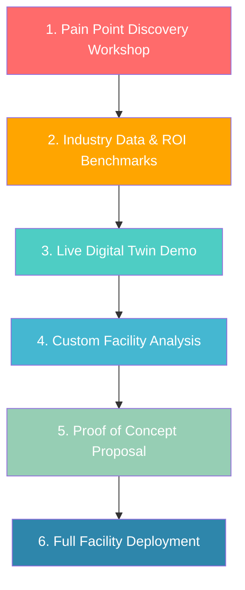

# Digital Twin Pitch Research — Bitcoin Mining Industry
## NVIDIA Omniverse-Powered Solutions

---

# 1. Industry Landscape & Context

## Bitcoin Mining Market Overview (2025–2026)

| Metric | Value |
|---|---|
| **Bitcoin Network Energy Consumption** | **175–211 TWh/year** (comparable to a mid-sized country) |
| **Post-Halving Block Reward** | **3.125 BTC** (halved in April 2024) |
| **Cooling as % of Total Power** | **10–30%** of facility electricity consumption |
| **Average Machine ROI Target** | **~12 months** per ASIC unit |
| **Average Payback Period (2025)** | **2.5–3 years** (declining profitability per petahash) |
| **Renewable Energy Adoption** | **>50% of operations** using some renewable sources |
| **Global Mining Hashrate Trend** | Continuously rising — record highs in 2025 |

## Key Industry Players

| Company | Scale | Notes |
|---|---|---|
| **Marathon Digital (MARA)** | One of largest publicly traded miners | Multi-site operations across U.S. |
| **Core Scientific** | Major infrastructure provider | Also pivoting to HPC/AI hosting |
| **Riot Platforms** | Large-scale U.S. miner | ~1 GW planned capacity |
| **CleanSpark** | Growing mid-tier miner | Focus on sustainable mining |
| **Bitdeer** | Global mining & technology | Developing proprietary ASICs |
| **Hive Digital** | Diversified miner | Green energy focus (Iceland, Sweden, Canada) |
| **Hut 8** | Canadian miner | Merged with US Bitcoin Corp |
| **Genesis Digital Assets** | Large private miner | Data center expertise |

---

# 2. Major Pain Points & Challenges

## 🔴 Pain Point 1: Massive Energy Costs & Inefficiency

**The Single Largest Operating Expense**

- Electricity constitutes **60–80% of total operating costs** for bitcoin miners
- The industry consumes **175–211 TWh annually** — more than many countries
- Cooling alone accounts for **10–30% of total facility power consumption**
- Post-halving economics mean every watt wasted directly erodes razor-thin margins
- Miners need electricity at **≤$0.05–0.06/kWh** to remain competitive
- Energy price spikes (even temporary) can flip a profitable operation to a loss-making one

**Impact**: A 100 MW facility paying $0.05/kWh spends **~$43.8M/year on electricity**. Even a **5% efficiency improvement = $2.19M saved annually**.

---

## 🔴 Pain Point 2: Thermal Management & Cooling Challenges

**The Silent Profit Killer**

- ASICs generate **extreme heat** — a single Antminer S21 Pro produces ~3,500W of thermal load
- Facilities with thousands of machines face cumulative thermal loads of **multiple megawatts**
- **Hotspots** from poor airflow design cause localized overheating → reduced hashrate, accelerated degradation
- Air-cooled facilities are louder, less efficient, and harder to scale in warm climates
- Immersion cooling offers 30–50% efficiency gains but is **complex to design and optimize**
- Incorrect cooling system sizing leads to either **wasted CAPEX** (over-provisioned) or **throttled performance** (under-provisioned)
- **Cooling system failures** = cascading miner shutdowns within minutes

**Impact**: Poor thermal management can reduce ASIC lifespan by **30–50%** and hashrate efficiency by **10–20%**. For a 100 MW facility, this translates to **millions in lost revenue per year**.

---

## 🔴 Pain Point 3: Facility Design & Layout Inefficiency

**Expensive Trial-and-Error**

- Mining facility design involves complex trade-offs: power distribution, airflow routing, rack density, cable management, access paths
- **No industry-standard tool** for simulating complete facility layouts before construction
- Layout mistakes discovered during construction or commissioning are **extremely costly to fix** ($100K–$1M+ per redesign)
- Scaling from 10 MW to 50 MW to 200 MW requires entirely different infrastructure approaches
- Container-based deployments need careful stacking, spacing, and airflow channel design
- Facilities in remote locations (near cheap power) face additional logistical challenges

**Impact**: Poor facility design can result in **15–25% lower hashrate density** compared to optimized layouts, directly reducing revenue per square foot.

---

## 🔴 Pain Point 4: Hardware Lifecycle & Fleet Management

**The ASIC Arms Race**

- ASICs are reaching **physical performance limits** — new generations offer diminishing returns
- Mining fleets consist of **mixed-generation hardware** with varying efficiency (J/TH) profiles
- Older machines become unprofitable as network difficulty rises — but **knowing exactly when to decommission** is complex
- Fleet decisions (upgrade vs. relocate vs. retire) involve millions in CAPEX
- **No centralized visibility** into fleet-wide health, performance, and efficiency metrics
- Firmware vulnerabilities and firmware-level attacks are increasing concerns

**Impact**: Operating machines past their profitable lifespan wastes electricity. Running a fleet with 20% unprofitable machines at a 100 MW site wastes **~$8.7M/year in electricity alone**.

---

## 🔴 Pain Point 5: Unplanned Downtime & Equipment Failure

**Every Minute Costs Money**

- Mining is a **24/7/365 operation** — every minute of downtime = lost revenue
- Common failure points: power supply units, fans, hash boards, cooling pumps, transformers
- **Reactive maintenance** is the norm — most operations wait for machines to fail before acting
- Diagnosing failures is manual and time-consuming, especially in facilities with 10,000+ machines
- Cascading failures (one failing component overloading others) can take out entire rows
- Remote/unmanned facilities face even longer response times

**Impact**: For a 100 MW facility generating ~$120K/day in revenue, even **1% unplanned downtime = ~$438K lost annually**. Real-world downtime is typically **3–8%**.

---

## 🔴 Pain Point 6: Regulatory & Environmental Compliance Pressure

**Growing Scrutiny from All Sides**

- Governments worldwide are introducing **energy use reporting, carbon disclosure, and noise regulations**
- Some jurisdictions **banning or restricting mining** (Kuwait, parts of China, some U.S. states)
- Germany proposing **80% renewable energy mandate** for miners
- U.S. states mandating **environmental impact disclosures**
- Community backlash over **noise pollution** (industrial fans running 24/7)
- ESG investors demanding verifiable sustainability metrics
- Carbon credit programs require **auditable energy and emissions data**

**Impact**: Non-compliance can result in **operational shutdowns, fines ($100K–$10M+), and inability to secure financing or insurance**.

---

## 🔴 Pain Point 7: Competition from AI/HPC for Energy & Infrastructure

**A New Existential Threat**

- AI and HPC companies are **outbidding miners** for power and data center capacity
- Some mining companies (Core Scientific, Hut 8) are pivoting to **host AI workloads** alongside mining
- AI tenants can pay **3–5× higher per MW** than mining economics support
- Miners need to prove they can **maximize value per MW** to justify continued power allocation
- Shared infrastructure (mining + AI) introduces **complex power and cooling optimization** challenges
- Grid operators increasingly prefer AI/HPC over mining for energy allocation

**Impact**: Miners who cannot demonstrate maximum efficiency per MW risk **losing power contracts** and **site access** to AI competitors.

---

## 🔴 Pain Point 8: Site Selection & New Facility Commissioning Risk

**High-Stakes, Low-Information Decisions**

- Choosing a new mining site involves evaluating **power cost, climate, regulatory, connectivity, and construction** factors
- Current approach: **spreadsheet-based analysis** + site visits + gut instinct
- A bad site selection can result in **millions in stranded capital** (wrong climate, unreliable power, hostile regulations)
- New facility commissioning takes **3–9 months** from site selection to first hash
- Commissioning delays directly translate to **lost mining revenue** during periods of favorable BTC price
- Scaling existing facilities requires careful phased planning to avoid disrupting live operations

**Impact**: A 3-month delay in commissioning a 50 MW facility at current economics = **~$5–15M in lost mining revenue**.

---

## 🔴 Pain Point 9: Power Distribution & Electrical Infrastructure Complexity

**The Hidden Engineering Challenge**

- Mining facilities require **heavy electrical infrastructure**: transformers, switchgear, bus bars, PDUs
- Unbalanced power loads create **inefficiency and safety hazards**
- Voltage drops across long cable runs reduce delivered power to machines
- **Power factor correction** is often neglected, resulting in utility penalties
- Electrical failures (transformer trips, breaker faults) can cascade through the facility
- Hybrid power setups (grid + solar + battery + generator) add management complexity

**Impact**: Electrical inefficiency typically wastes **3–8% of total power** before it even reaches the miners. At 100 MW, that's **$1.3–3.5M/year wasted**.

---

## 🔴 Pain Point 10: Lack of Unified Operational Visibility

**Flying Blind at Scale**

- Most operations use **fragmented monitoring**: ASIC dashboards, DCIM tools, BMS, pool dashboards — none integrated
- No single view correlating **power consumption ↔ hashrate output ↔ thermal performance ↔ profitability**
- Difficult to compare performance across multiple sites or containers
- Decision-making relies on **lagging indicators** (monthly reports) instead of real-time intelligence
- Data silos prevent effective root-cause analysis of underperformance

**Impact**: Without integrated visibility, operators are making **suboptimal decisions** on an ongoing basis, leaving **10–20% of potential performance** on the table.

---

# 3. Digital Twin Solutions — Powered by NVIDIA Omniverse

## 3.1 Core Technology Stack

| Technology | Role in Bitcoin Mining Context |
|---|---|
| **NVIDIA Omniverse** | Open platform for building physics-accurate, real-time digital twins of mining facilities |
| **OpenUSD** | Universal Scene Description for 3D facility models — interoperable with all major CAD/BIM tools |
| **NVIDIA PhysicsNeMo / Modulus** | Physics-informed neural networks for thermal, airflow (CFD), and electrical simulation |
| **NVIDIA Metropolis** | Visual AI for equipment monitoring, anomaly detection, safety compliance |
| **NVIDIA NIM™ Microservices** | Pre-trained AI models deployable as APIs for predictive analytics |
| **IoT Sensor Integration** | Real-time data from power meters, temperature sensors, vibration sensors, flow meters |

---

## 3.2 Solution Mapping: Pain Point → Digital Twin USP

### ⚡ USP 1: Facility-Wide Energy Optimization Engine

**Pain Points Solved**: Energy costs, electrical inefficiency, power distribution

| Capability | Benefit |
|---|---|
| Real-time energy flow modeling across entire facility | Identify exact sources of energy waste (transformers, cables, cooling, idle machines) |
| Per-machine and per-row power efficiency tracking | Pinpoint underperforming units consuming more J/TH than peers |
| Power distribution simulation & load balancing | Optimize transformer loading, reduce voltage drop losses |
| Energy sourcing scenario modeling (grid vs. solar vs. battery vs. curtailment) | Make data-driven decisions on hybrid power strategies |
| Demand-response simulation | Model profitability impact of participating in grid curtailment programs |

**Proven Impact**:
- ✅ **Up to 30% total energy savings** demonstrated in data center liquid cooling digital twins (ArXiv research)
- ✅ **20–35% energy savings** typical with digital twin implementation (industry benchmark)
- ✅ **3–8% recovery** of wasted electrical distribution losses

**ROI Example**: A 100 MW facility saving **5% on energy** = **~$2.19M/year** at $0.05/kWh

---

### ⚡ USP 2: Advanced Thermal & Cooling Simulation

**Pain Points Solved**: Cooling inefficiency, hotspots, over/under-provisioned cooling, hardware degradation

| Capability | Benefit |
|---|---|
| **PhysicsNeMo** CFD simulation of entire facility airflow | Visualize heat plumes, dead zones, and recirculation patterns in 3D |
| Air-cooled vs. immersion-cooled layout comparison | Test cooling strategies virtually before $M investment |
| Hot/cold aisle containment optimization | Maximize cooling efficiency for ASIC row layouts |
| Real-time thermal digital twin with IoT sensors | Detect emerging hotspots before machines throttle or fail |
| Cooling system capacity planning for facility expansion | Right-size cooling CAPEX when adding hashrate capacity |
| Container-based facility thermal modeling | Optimize container spacing, vent positioning, and fan speeds |

**Proven Impact**:
- ✅ **30.1% total energy savings** in liquid cooling optimization (research study)
- ✅ **15,000× speedup** in airflow/thermal prediction vs. traditional CFD (NVIDIA Modulus)
- ✅ Cooling accounts for **10–30% of mining costs** — optimizing this directly boosts margins
- ✅ Ability to identify areas where cooling is **over-provisioned** = immediate cost savings

**ROI Example**: Reducing cooling energy by **20%** in a 100 MW facility where cooling = 15% of load = **~$1.3M/year saved**

---

### ⚡ USP 3: Virtual Facility Design & Layout Planning

**Pain Points Solved**: Facility design risk, layout inefficiency, construction delays, scaling challenges

| Capability | Benefit |
|---|---|
| Photorealistic 3D facility design in Omniverse | Design, iterate, and validate layouts in virtual environment before construction |
| Full physics simulation (airflow, power, thermal) on virtual layout | Identify design flaws before pouring concrete |
| What-if scenario testing | Compare 100+ rack configurations, container layouts, cooling strategies in hours |
| Construction sequence simulation | Optimize build-out phasing, minimize construction timeline |
| Multi-stakeholder collaboration in shared 3D environment | Electrical engineers, cooling experts, construction teams — all working on same model |
| Scalability planning (10 MW → 50 MW → 200 MW) | Design expansion paths that don't require retrofitting existing infrastructure |

**Proven Impact**:
- ✅ **BMW**: 30% reduction in production planning costs using Omniverse facility twins
- ✅ **PepsiCo**: 90% of design issues identified before physical implementation
- ✅ **Mercedes-Benz**: 2× speed in facility conversion/construction
- ✅ Virtual commissioning reduces physical commissioning time by **up to 70%**

**ROI Example**: Avoiding **1 major layout redesign** during construction = **$200K–$1M+ saved**. Accelerating commissioning by **2 months** on a 50 MW site = **$3–10M in earlier revenue**.

---

### ⚡ USP 4: Predictive Maintenance & Zero-Downtime Operations

**Pain Points Solved**: Unplanned downtime, equipment failure, reactive maintenance, remote facility management

| Capability | Benefit |
|---|---|
| IoT sensor data (vibration, temperature, power draw) integrated into 3D digital twin | Visualize equipment health **spatially** — see exactly which machine, in which row, is degrading |
| AI-driven failure prediction models | Predict PSU, fan, and hash board failures **days before** they occur |
| Automated maintenance scheduling | Move from reactive → predictive → prescriptive maintenance |
| Root-cause analysis with spatial context | Trace cascading failures through power distribution and cooling systems |
| Remote monitoring with 3D context | Manage unmanned/remote facilities from a central command center |

**Proven Impact**:
- ✅ **30–50% reduction** in unplanned downtime (digital twin industry benchmark)
- ✅ **10–40% reduction** in maintenance costs
- ✅ **5–15% increase** in asset availability
- ✅ **35% improvement** in Overall Equipment Effectiveness (OEE)

**ROI Example**: Reducing downtime from **5% to 2.5%** on a $120K/day revenue facility = **~$1.1M/year recovered**

---

### ⚡ USP 5: ASIC Fleet Intelligence & Lifecycle Optimization

**Pain Points Solved**: Mixed-generation fleet management, decommissioning decisions, firmware vulnerability

| Capability | Benefit |
|---|---|
| Fleet-wide digital twin tracking every machine's model, age, efficiency, and health | Complete visibility across 10,000+ ASICs |
| Per-machine profitability modeling (J/TH × power cost × BTC price × difficulty) | Know exactly which machines are profitable and which are burning cash |
| Automated decommissioning recommendations | Data-driven "retire vs. relocate vs. keep running" decisions based on real-time economics |
| Firmware and performance anomaly detection | Flag machines with abnormal power consumption or degraded hashrate |
| What-if fleet upgrade modeling | "If we replace 2,000 S19s with 2,000 S21 Pros, what's the net impact on hashrate, power, and ROI?" |

**Proven Impact**:
- ✅ Eliminates **20% fleet waste** from running unprofitable machines
- ✅ Optimizes CAPEX timing for fleet upgrades based on real economic models
- ✅ Extends useful machine life by **10–20%** through optimized operating conditions

**ROI Example**: Identifying and retiring **20% unprofitable machines** in a 100 MW fleet = **$8.7M/year in wasted electricity avoided** (redeployed to profitable machines or curtailed)

---

### ⚡ USP 6: Site Selection & New Facility Simulation

**Pain Points Solved**: Site selection risk, commissioning delays, stranded capital

| Capability | Benefit |
|---|---|
| Climate-integrated thermal simulation | Model facility performance in specific geographic climates (Texas heat vs. Iceland cold) |
| Power infrastructure modeling | Simulate grid reliability, solar/wind intermittency, and battery backup scenarios |
| Regulatory scenario analysis | Model impact of different regulatory regimes on operational costs |
| Virtual commissioning | Fully simulate facility operations before physical build-out — validate design |
| Total Cost of Ownership (TCO) modeling | Compare sites holistically: power cost + cooling cost + construction cost + regulatory risk |

**Proven Impact**:
- ✅ Reduces site selection risk from **qualitative guesswork to quantitative simulation**
- ✅ Virtual commissioning **reduces physical commissioning time by up to 70%**
- ✅ Prevents **$M+ in stranded capital** from poor site choices

---

### ⚡ USP 7: Real-Time Operations Command Center

**Pain Points Solved**: Fragmented monitoring, lack of unified visibility, slow decision-making

| Capability | Benefit |
|---|---|
| Unified 3D command center visualizing all facilities | Single pane of glass across multiple sites, containers, and geographies |
| Live IoT overlay: power, temperature, hashrate, humidity | Real-time spatial awareness — not just flat dashboard numbers |
| Cross-site performance benchmarking | Compare efficiency metrics (J/TH, PUE, hashrate/MW) across facilities |
| AI-powered anomaly detection (**Metropolis**) | Visual AI monitors facility cameras for safety issues, unauthorized access, equipment anomalies |
| Alert-driven exception management | Automated notifications for thermal exceedances, power fluctuations, performance drops |

**Proven Impact**:
- ✅ Enables **centralized remote management** reducing on-site staffing needs
- ✅ Real-time spatial context accelerates **root-cause analysis by 50–70%** vs. flat dashboards
- ✅ Cross-site benchmarking unlocks **10–20% performance improvement** by propagating best practices

---

### ⚡ USP 8: Sustainability & Regulatory Compliance Dashboard

**Pain Points Solved**: Regulatory pressure, ESG reporting, carbon tracking, community relations

| Capability | Benefit |
|---|---|
| Automated carbon emission tracking per MWh | Audit-ready data for regulators, investors, and carbon credit programs |
| Renewable energy mix visualization | Demonstrate exact % of hydro, solar, wind, and grid power in real-time |
| Noise emission modeling | Simulate and mitigate noise propagation to neighboring communities |
| Regulatory scenario planning | Model impact of proposed regulations (e.g., "80% renewable mandate") on operations |
| ESG reporting automation | Generate compliance reports with verified, sensor-backed data |

**Proven Impact**:
- ✅ Positions mining operations as **ESG-compliant** — critical for **financing, insurance, and public relations**
- ✅ Enables participation in **carbon credit markets** — potential new revenue stream
- ✅ Noise modeling prevents **community complaints and regulatory action** before they happen

---

### ⚡ USP 9: Mining + AI/HPC Infrastructure Co-Optimization

**Pain Points Solved**: Competition from AI for power/infrastructure, maximizing value per MW

| Capability | Benefit |
|---|---|
| Hybrid workload simulation (mining + AI hosting) | Model optimal power allocation between mining and AI tenants |
| Dynamic workload switching based on BTC price/difficulty | "When mining margin drops below X, automatically shift MW to AI hosting" |
| Shared cooling infrastructure optimization | Design cooling systems that serve both mining and HPC efficiently |
| Revenue optimization modeling | Compare revenue per MW across mining, AI hosting, and grid services |

**Proven Impact**:
- ✅ AI hosting can generate **3–5× revenue per MW** compared to mining during unfavorable periods
- ✅ Enables miners to **retain power contracts** by demonstrating maximum value utilization
- ✅ Diversifies revenue streams — reducing dependence on BTC price

---

### ⚡ USP 10: Immersion Cooling Design & Optimization

**Pain Points Solved**: Transitioning from air to immersion cooling, maximizing immersion cooling efficiency

| Capability | Benefit |
|---|---|
| Immersion tank thermal simulation | Model fluid dynamics, heat transfer rates, and optimal tank configurations |
| ASIC submersion density planning | Determine maximum machines per tank without thermal throttling |
| Heat exchanger sizing optimization | Right-size heat rejection systems for specific climates and loads |
| Single-phase vs. two-phase comparison | Simulate both approaches in the digital twin to make data-driven decisions |
| Waste heat recovery modeling | Simulate revenue potential from greenhouse heating, district heating, etc. |

**Proven Impact**:
- ✅ Immersion cooling delivers **30–50% better efficiency** vs. air cooling when properly optimized
- ✅ Digital twin prevents **over- or under-sizing** cooling infrastructure = optimal CAPEX
- ✅ Waste heat recovery can generate **$0.5–2M/year** additional revenue for large facilities

---

# 4. ROI & Market Opportunity

## Summary ROI Metrics for Mining Clients

| Metric | Expected Impact |
|---|---|
| **Energy cost reduction** | **5–30%** (facility-dependent) |
| **Cooling efficiency improvement** | **20–30%** reduction in cooling power |
| **Unplanned downtime reduction** | **30–50%** |
| **Maintenance cost reduction** | **10–40%** |
| **Facility commissioning acceleration** | **Up to 70% faster** |
| **Fleet waste elimination** | **Identify & remove 10–20% unprofitable machines** |
| **Hashrate density improvement** | **15–25%** better hashrate per sq ft with optimized layouts |
| **Facility design cost avoidance** | **$200K–$1M+** per redesign avoided |
| **First-year ROI** | **200–500%** (depending on facility scale) |
| **Payback period** | **3–6 months** |

## Dollar Impact for a Reference 100 MW Facility

| Value Driver | Annual Savings/Revenue |
|---|---|
| 5% energy optimization | **$2.19M** |
| 20% cooling efficiency gain | **$1.31M** |
| Downtime reduction (5% → 2.5%) | **$1.10M** |
| Fleet optimization (retire 20% unprofitable) | **$8.70M** (redeployed or curtailed) |
| Maintenance cost reduction (20%) | **$0.5–1.0M** |
| Construction delay avoidance (2 months) | **$3–10M** (one-time) |
| **Total Annual Recurring Value** | **~$5–13M/year** |

---

# 5. Competitive Differentiation — Why NVIDIA Omniverse?

| Advantage | Detail |
|---|---|
| **GPU-Accelerated Physics** | Only platform with native GPU-accelerated thermal, airflow, and electrical simulation — **15,000× faster than traditional CFD** |
| **OpenUSD Interoperability** | Works with all major CAD, BIM, and engineering tools — no vendor lock-in |
| **Real-Time Rendering** | Photorealistic visualization of facilities for design review, investor presentations, stakeholder alignment |
| **AI-Native Platform** | Seamlessly integrates predictive analytics, anomaly detection, and optimization AI |
| **Proven Enterprise Adoption** | BMW, Mercedes-Benz, Amazon, PepsiCo, Foxconn — same platform, adapted for mining |
| **Physics-Accurate Simulation** | Not just visualization — actual physics-based thermal, fluid, and electrical modeling |
| **Scalable Architecture** | From single container to 200 MW mega-facility — single platform |
| **Cloud & On-Prem** | Deploy on NVIDIA DGX, cloud, or hybrid — matches miners' infrastructure preferences |

---

# 6. Pitch Positioning

## One-Liner
> *"Build a physics-accurate, AI-powered virtual replica of your entire mining operation — optimize every watt, predict every failure, and simulate every decision before it costs real money."*

## Elevator Pitch (30 seconds)
> Your mining operation runs 24/7 and every watt you waste comes straight off your margin. Our NVIDIA Omniverse-powered digital twin gives you a **complete virtual replica of your facility** — real-time thermal maps showing exactly where you're losing cooling efficiency, **AI that predicts equipment failures days in advance**, and the ability to **simulate facility expansions or layout changes before spending a dollar on construction**. Companies using this technology see **5–30% energy savings** and **50% less downtime**. In a post-halving world where margins are razor-thin, this is the difference between profitable and unprofitable mining.

## For Mining Companies Building New Facilities
> You're about to invest $50–200M in a new facility. Our digital twin lets you **simulate the entire facility in physics-accurate detail before breaking ground** — test 100+ layouts for optimal airflow, validate your cooling system sizing, and identify design flaws that would cost millions to fix post-construction. Virtual commissioning **cuts your time-to-first-hash by up to 70%**, getting you mining revenue months earlier.

## For Operating Mining Companies
> Your facility is running, but is it running **optimally**? Our digital twin overlays real-time IoT data on a 3D model of your operation, showing you **exactly which machines are unprofitable, where your cooling is over-provisioned, and when your equipment will fail** — before it happens. Clients achieve **$5–13M/year in savings** on a 100 MW facility through energy optimization, downtime reduction, and fleet intelligence.

## For Miners Exploring AI/HPC Diversification
> You're sitting on valuable power infrastructure that AI companies want. Our digital twin helps you **model the optimal split between mining and AI hosting** — simulate shared cooling systems, model revenue per MW under different workload mixes, and make data-driven decisions about infrastructure conversion. Maximize the value of every megawatt you control.

---

# 7. Recommended Pitch Flow

### Step 1 — Pain Point Discovery Workshop
- Conduct discovery session with mining ops team
- Quantify current losses: energy waste %, downtime hours, cooling costs, fleet efficiency
- Understand facility type: air-cooled, immersion, container-based, warehouse-style

### Step 2 — Industry Data & ROI Benchmarks
- Present the pain points with industry data (from this document)
- Show ROI benchmarks specific to their facility scale
- Share case studies from data center digital twin deployments

### Step 3 — Live Digital Twin Demo
- Demonstrate a reference mining facility digital twin
- Show real-time thermal visualization, airflow simulation, predictive maintenance
- Demonstrate fleet intelligence dashboard

### Step 4 — Custom Facility Analysis
- Request facility blueprints, power data, and sensor feeds
- Build preliminary digital twin model of their specific facility
- Present custom ROI projection based on their actual data

### Step 5 — Proof of Concept Proposal
- Scope a PoC: one container/row/zone of the facility
- **8–12 week timeline**, measurable KPIs (energy savings, hotspot reduction, downtime prediction accuracy)
- Fixed-cost engagement with clear success criteria

### Step 6 — Full Facility Deployment
- Expand to full facility digital twin
- Integrate all IoT data sources
- Deploy predictive maintenance and fleet optimization AI
- Establish ongoing optimization partnership

---

# 8. Key Objection Handling

| Objection | Response |
|---|---|
| *"We already monitor our machines with pool dashboards and BMS"* | Pool dashboards show hashrate. BMS shows temperature. Neither tells you **why** Row 7 is 15% less efficient than Row 3, or that your transformer will trip in 48 hours. A digital twin correlates **all** data in spatial context. |
| *"We can't afford this in a tight-margin environment"* | Tight margins are exactly why you need this. A 5% energy savings on 100 MW = $2.19M/year. The entire platform pays for itself in **90 days**. Can you afford NOT to optimize? |
| *"Our facilities are too simple/small for this"* | We can start with a single container or a single row. The PoC is designed to prove value at small scale before expanding. Even a 5 MW operation can save $100K+/year. |
| *"We're planning to pivot to AI hosting anyway"* | Our digital twin helps you **model the pivot** — simulate shared cooling for mining + AI workloads, optimize power allocation, and model revenue scenarios. It's the planning tool for your transition. |
| *"This seems like a lot of technology overhead"* | We handle the deployment. The digital twin is a **managed service** — you provide the data, we build and maintain the model. Your team interacts through an intuitive 3D dashboard. |
| *"How is this different from regular DCIM software?"* | DCIM gives you data in spreadsheets and 2D floor plans. Our digital twin gives you **physics-accurate simulation** — actual CFD airflow modeling, thermal prediction, and what-if scenario testing. It doesn't just report problems; it predicts and prevents them. |

---

# 9. Target Customer Segments

| Segment | Typical Scale | Primary Value Proposition | PoC Size |
|---|---|---|---|
| **Large-scale miners** (100+ MW) | MARA, Riot, Core Scientific | Energy optimization + fleet intelligence + multi-site command center | 1 facility section |
| **Mid-tier miners** (10–100 MW) | CleanSpark, Hive, regional operators | Facility design + cooling optimization + predictive maintenance | 1 container/row |
| **Mining-to-AI converters** | Companies pivoting to host AI | Hybrid workload modeling + infrastructure co-optimization | Power allocation model |
| **New facility developers** | Greenfield projects | Virtual design + commissioning + site selection simulation | Full virtual design |
| **Immersion cooling adopters** | Companies transitioning to immersion | Immersion system design + thermal optimization | 1 immersion tank/pod |
| **Mining infrastructure providers** | Container/facility builders | Design validation + customer demos | Reference facility |
