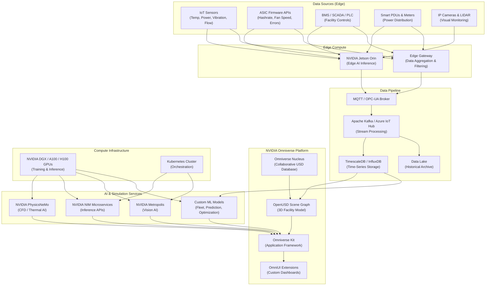
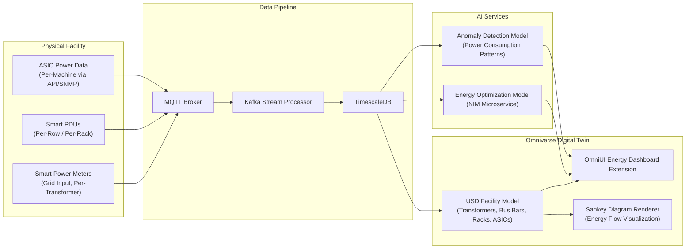
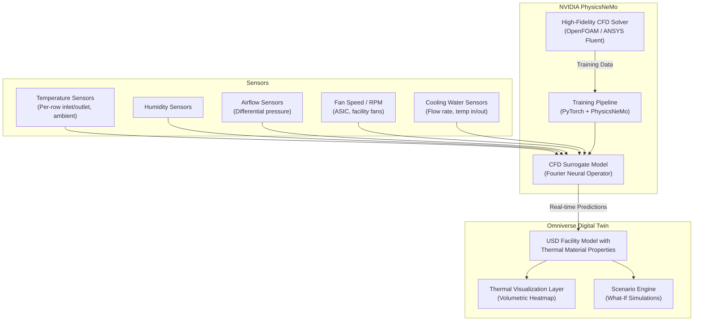
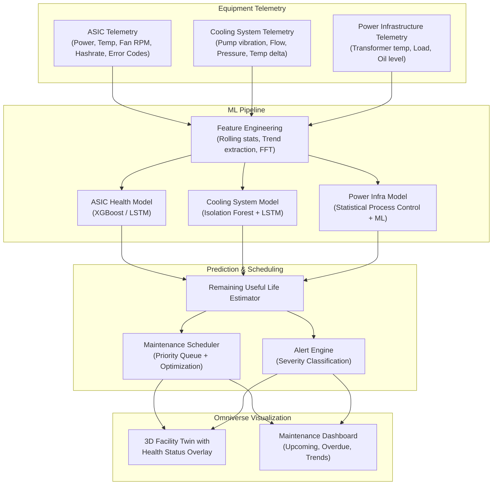
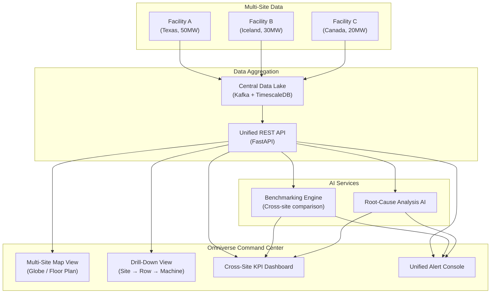
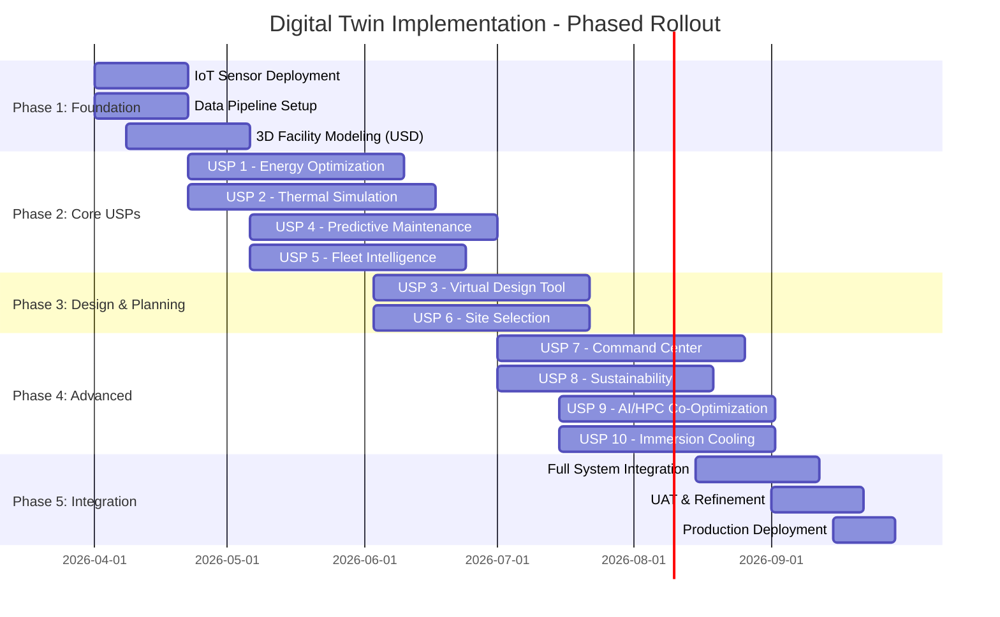

# Technical Implementation Approach
## NVIDIA Omniverse Digital Twin for Bitcoin Mining Operations
### All 10 USPs — Architecture, Stack, Data Flow & Deployment

---

# Shared Foundation: Platform Architecture

Before diving into individual USPs, all solutions share a common NVIDIA Omniverse platform layer.

## Core Technology Stack



## Shared Infrastructure Requirements

| Component | Specification |
|---|---|
| **Edge Compute** | NVIDIA Jetson Orin NX (per container/zone) for local inference |
| **IoT Protocol** | MQTT v5 + OPC-UA for industrial sensor data |
| **Streaming** | Apache Kafka or Azure IoT Hub for event-driven data ingestion |
| **Time-Series DB** | TimescaleDB or InfluxDB for high-frequency sensor data |
| **GPU Compute** | NVIDIA A100/H100 for training; L40S or RTX 6000 for visualization |
| **3D Asset Format** | OpenUSD (Universal Scene Description) — all facility models in USD |
| **Collaboration** | Omniverse Nucleus server for multi-user USD scene sharing |
| **Deployment** | Kubernetes + Docker containers for all microservices |
| **Networking** | 1–10 Gbps LAN for sensor data; low-latency link to GPU compute |

---

# USP 1: Facility-Wide Energy Optimization Engine

## Objective
Create a real-time, digital twin-powered energy monitoring and optimization system that tracks power flow from grid input through transformers, PDUs, and individual ASICs — identifying waste at every stage.

## System Architecture



## Technical Implementation Steps

### Phase 1: Data Acquisition (Weeks 1–3)

**Sensor Deployment & Integration**:
1. Deploy smart power meters at:
   - Grid/utility input point (main breaker)
   - Each transformer secondary
   - Each PDU or bus bar distribution point
2. Configure ASIC telemetry collection:
   - Use ASIC manufacturer API (e.g., Bitmain's cgminer API, Braiins OS API)
   - Poll per-machine power draw (watts), input voltage, fan speed at **30-second intervals**
3. Deploy edge gateway (Jetson Orin or industrial PC) for data aggregation
4. Establish MQTT broker (Mosquitto or HiveMQ) for sensor data transport

**Data Schema Design**:
```json
{
  "timestamp": "2026-03-12T10:00:00Z",
  "device_type": "asic|pdu|transformer|meter",
  "device_id": "R03-S07-M042",
  "location": {"row": 3, "shelf": 7, "position": 42},
  "metrics": {
    "power_watts": 3425.6,
    "input_voltage": 238.4,
    "current_amps": 14.38,
    "power_factor": 0.97,
    "energy_kwh_cumulative": 28451.2
  }
}
```

### Phase 2: Digital Twin 3D Model (Weeks 2–5)

**Facility Modeling in OpenUSD**:
1. Create 3D model of facility in Omniverse using:
   - Existing CAD/BIM files (imported via Omniverse Connectors for AutoCAD, Revit, etc.)
   - LIDAR scan data for as-built accuracy (optional but recommended)
   - SimReady asset library for standard components (transformers, switchgear, racks, containers)
2. Build the USD scene hierarchy:
   ```
   /Facility
     /Electrical
       /Grid_Input
       /Transformer_01...N
       /BusBar_01...N
       /PDU_01...N
     /Mining_Rows
       /Row_01
         /Rack_01
           /ASIC_001...050
     /Cooling  (linked to USP 2)
     /Building_Shell
   ```
3. Assign IoT data bindings:
   - Each USD prim (3D object) has custom attributes for live sensor data
   - Use Omniverse IoT extension to map MQTT topics → USD prim attributes

### Phase 3: Energy Visualization & Dashboards (Weeks 4–7)

**OmniUI Extension Development**:
1. Build custom Omniverse Kit extension (Python + OmniUI) for energy visualization:
   - **3D Heatmap Overlay**: Color-code each ASIC/rack/row by power efficiency (J/TH)
   - **Sankey Diagram**: Real-time energy flow from grid → transformer → PDU → machines
   - **Loss Waterfall**: Show power losses at each stage (cable losses, transformer losses, PF penalties)
   - **KPI Panel**: PUE, J/TH fleet average, cost-per-TH, power factor
2. Implement alert thresholds:
   - Single machine consuming >110% expected power → highlight RED
   - Transformer load >85% capacity → WARNING
   - Power factor <0.95 → penalty alert

### Phase 4: AI Optimization (Weeks 6–10)

**Machine Learning Models**:
1. **Anomaly Detection**: Train isolation forest / autoencoder on historical power patterns
   - Input: Per-machine power draw timeseries (30-sec intervals, 30-day history)
   - Output: Anomaly score per machine — flag degraded PSUs, stuck fans, hash board faults
   - Deploy as NIM microservice (REST API for real-time scoring)
2. **Load Balancing Optimization**: Mixed-integer linear programming (MILP) model
   - Input: Real-time power draw per PDU/transformer, capacity limits
   - Output: Recommended machine reallocation to balance transformer loads
3. **Demand Response Optimizer**: 
   - Input: Grid electricity pricing (real-time/spot market), BTC price, network difficulty
   - Output: Optimal curtailment schedule — which machines to shut down during price spikes

### Phase 5: Continuous Optimization Loop (Ongoing)

- Real-time dashboard refresh: **every 30 seconds**
- AI model re-training: **weekly** on new data
- Monthly optimization reports generated automatically

## Deliverables
| Deliverable | Format |
|---|---|
| 3D Facility Energy Model | OpenUSD scene in Omniverse Nucleus |
| Real-Time Energy Dashboard | OmniUI Extension (Python) |
| Anomaly Detection API | NIM Microservice (Docker container) |
| Load Balancing Optimizer | Python service + REST API |
| Demand Response Module | Scheduler with grid price API integration |

---

# USP 2: Advanced Thermal & Cooling Simulation

## Objective
Deploy physics-accurate CFD simulation to model airflow and thermal behavior across the entire mining facility, enabling real-time hotspot detection, cooling optimization, and what-if scenario testing.

## System Architecture



## Technical Implementation Steps

### Phase 1: Thermal Sensor Deployment (Weeks 1–3)

1. Deploy temperature sensors at standardized positions:
   - **Cold aisle inlet**: Every 2nd rack, at bottom/middle/top (3 sensors per rack pair)
   - **Hot aisle outlet**: Matching positions
   - **Ambient**: Facility perimeter, roof space, near cooling intakes
   - **Per-ASIC exhaust**: Sample 10% of machines for high-resolution data
2. Deploy differential pressure sensors across hot/cold aisle containment
3. Deploy airflow velocity sensors at fan walls and intake plenums
4. For liquid/immersion cooling: flow rate sensors, coolant temp in/out, TDS sensors

**Sensor Data Rate**: Temperature every **10 seconds**, airflow every **30 seconds**

### Phase 2: Baseline CFD Simulation (Weeks 2–6)

**High-Fidelity CFD Model Setup**:
1. Create detailed geometry of facility in CAD:
   - Rack positions, ASIC heat output per machine (use rated TDP from spec sheets)
   - Fan positions, speeds, and flow characteristics
   - Intake/exhaust vent positions and dimensions
   - Cooling system specifications (CRAC units, DX, evaporative, immersion tanks)
2. Run baseline CFD simulations using **OpenFOAM** or **ANSYS Fluent**:
   - Turbulence model: k-epsilon or k-omega SST
   - Boundary conditions: Heat flux per ASIC, inlet temperature, fan flow rates
   - Generate **100–500 simulation cases** varying:
     - Ambient temperature (5°C to 45°C in 5°C steps)
     - Facility load (25%, 50%, 75%, 100%)
     - Fan speed settings (50%, 75%, 100%)
     - Missing/failed ASIC configurations

**Output**: Temperature field, velocity field, and pressure field for each case — stored as structured training data.

### Phase 3: PhysicsNeMo AI Surrogate Training (Weeks 5–9)

**Training the AI CFD Model**:
1. Prepare training dataset from Phase 2 CFD results:
   - Input features: Ambient temp, per-rack heat load, fan speeds, cooling settings
   - Output: 3D temperature field, velocity field
2. Train **Fourier Neural Operator (FNO)** model using NVIDIA PhysicsNeMo:
   ```python
   # Simplified PhysicsNeMo FNO training concept
   from physicsnemo.models.fno import FourierNeuralOperator
   from physicsnemo.data import DataPipe

   model = FourierNeuralOperator(
       in_channels=4,     # ambient_temp, heat_load, fan_speed, cooling_mode
       out_channels=2,    # temperature_field, velocity_magnitude
       num_fno_layers=4,
       fno_modes=24,
       padding=4,
   )
   
   # Training with physics-informed loss (Navier-Stokes + energy equation)
   # + data-driven loss from CFD results
   ```
3. Validate against held-out CFD cases — target: **<5% temperature prediction error**
4. Deploy trained model as NIM microservice for real-time inference

**Performance Target**: Predict full facility thermal field in **<100ms** (vs. hours for traditional CFD)

### Phase 4: Omniverse Thermal Visualization (Weeks 7–10)

1. Extend USD facility model with thermal properties:
   - Material properties: thermal conductivity, emissivity per surface type
   - Custom USD attributes for live temperature values per zone
2. Build **Volumetric Thermal Heatmap** renderer:
   - Color gradient from blue (cold) → green (optimal) → red (critical)
   - Overlay on 3D facility model — see hotspots in spatial context
3. Add **airflow particle visualization**:
   - Render air velocity vectors as animated particles flowing through facility
   - Visually show dead zones, recirculation, and short-circuiting
4. Build **Scenario Testing Interface**:
   - "What if we add 500 machines to Row 7?"
   - "What if ambient temp reaches 45°C?"
   - "What if CRAC unit #3 fails?"
   - AI surrogate provides answers in **real-time** — adjust sliders, see thermal change instantly

### Phase 5: Closed-Loop Optimization (Weeks 9–12)

1. Connect digital twin thermal predictions to BMS/facility controls:
   - Variable-speed fan control recommendations
   - CRAC unit staging recommendations
   - Damper position optimization
2. Implement **cooling energy minimization loop**:
   - Objective: Minimize cooling power while keeping all ASICs below maximum operating temperature
   - Constraint: No zone exceeds thermal threshold (e.g., 35°C inlet)
   - Method: Gradient-based optimization using the differentiable AI surrogate

## Deliverables
| Deliverable | Format |
|---|---|
| High-fidelity CFD baseline model | OpenFOAM / Fluent case files |
| Trained FNO thermal surrogate | PhysicsNeMo model (PyTorch checkpoint) |
| Real-time thermal inference API | NIM Microservice (Docker) |
| 3D Thermal Heatmap Visualization | OmniUI Extension |
| Scenario Testing Dashboard | Interactive web UI embedded in Omniverse |
| Cooling Optimization Recommendations | Automated BMS integration |

---

# USP 3: Virtual Facility Design & Layout Planning

## Objective
Enable pre-construction virtual design and validation of mining facilities — test hundreds of layout configurations, validate airflow, power distribution, and cooling capacity before committing capital.

## Technical Implementation Steps

### Phase 1: Parameterized Facility Template Library (Weeks 1–4)

1. Build a **SimReady asset library** in OpenUSD:
   - **Mining containers**: Standard 40ft, custom dimensions, with internal rack configs
   - **ASIC models**: Antminer S21 Pro, S21 XP, Whatsminer M60s, M66s (with accurate thermal/power specs)
   - **Cooling components**: CRAC units, evaporative coolers, immersion tanks, heat exchangers, fan walls
   - **Electrical components**: Transformers (500kVA–5MVA), switchgear, PDUs, bus bars, cable trays
   - **Building elements**: Steel structures, concrete pads, intake/exhaust vents, doors, corridors
2. Each asset includes:
   - Accurate geometry (3D mesh)
   - Physical properties (weight, thermal output, power draw, airflow resistance)
   - Connection interfaces (power in/out, coolant in/out, airflow path)

### Phase 2: Design Workflow in Omniverse (Weeks 3–7)

1. **Drag-and-drop facility builder**:
   - Custom OmniUI extension for facility layout
   - Place containers, racks, cooling units, electrical equipment on a site plan
   - Snap-to-grid with configurable spacing parameters
2. **Automated validation rules**:
   - Power capacity check: Total ASIC load vs. transformer/grid capacity
   - Cooling capacity check: Total heat rejection vs. cooling system rating
   - Aisle width compliance: Minimum access path widths
   - Electrical clearance: Transformer setback distances
3. **Parametric design exploration**:
   - Adjust parameters: rack density, container spacing, cooling system type
   - Generate and compare multiple design variants automatically
   - Rank designs by: hashrate density (TH/s per sq ft), PUE, CAPEX, cooling efficiency

### Phase 3: Physics Validation (Weeks 5–9)

1. Run PhysicsNeMo thermal simulation on each design variant:
   - Predict thermal performance under worst-case conditions (peak summer ambient)
   - Identify hotspot risks in proposed layouts
   - Validate cooling system sizing
2. Run electrical simulation:
   - Load flow analysis across proposed power distribution
   - Voltage drop calculations for cable runs
   - Short-circuit analysis for protection coordination
3. Generate **automated design report**:
   - Pass/fail for each validation criterion
   - Heatmap visualization of thermal performance
   - Power distribution single-line diagram with loading %

### Phase 4: Multi-Stakeholder Collaboration (Weeks 6–10)

1. Use Omniverse Nucleus for **real-time collaborative design review**:
   - Electrical engineers, mechanical engineers, architects, operators — all viewing/editing same USD scene
   - Annotation and markup tools for design feedback
   - Version control for design iterations
2. Generate **construction-ready outputs**:
   - 2D floor plans and sections extracted from 3D model
   - Bill of Materials (BOM) auto-generated from placed USD assets
   - Construction sequencing animation

## Deliverables
| Deliverable | Format |
|---|---|
| SimReady Mining Asset Library | OpenUSD assets in Omniverse Nucleus |
| Facility Design Tool (OmniUI Extension) | Python extension for Omniverse Kit |
| Automated Validation Engine | Python + PhysicsNeMo integration |
| Design Comparison Dashboard | Interactive web UI |
| Construction-Ready Outputs | 2D drawings, BOM, sequencing animation |

---

# USP 4: Predictive Maintenance & Zero-Downtime Operations

## Objective
Deploy AI-driven predictive maintenance across all mining equipment — ASICs, cooling systems, power infrastructure — to predict failures before they occur, eliminate unplanned downtime, and optimize maintenance scheduling.

## System Architecture



## Technical Implementation Steps

### Phase 1: Telemetry Data Collection (Weeks 1–4)

**ASIC Telemetry** (Primary Failure Source):
- Data points per machine (polled every **60 seconds**):
  | Metric | Source | Failure Signal |
  |---|---|---|
  | Hashrate (TH/s) | Mining pool API / cgminer | Declining hashrate → hash board degradation |
  | Power consumption (W) | ASIC API / Smart PDU | Increasing W/TH → PSU or board degradation |
  | Chip temperature (°C) | ASIC API | Rising trend → fan failure or dust buildup |
  | Fan RPM (per fan) | ASIC API | Declining RPM → bearing wear |
  | Error rate (HW errors) | ASIC API | Increasing errors → chip failure approaching |
  | Uptime | ASIC API | Frequent restarts → PSU or firmware issue |

**Cooling System Telemetry**:
- Pump vibration (accelerometer), coolant flow rate, pressure differential, temperature delta

**Power Infrastructure Telemetry**:
- Transformer oil temperature, winding temperature, load current, tap changer position

### Phase 2: ML Model Development (Weeks 3–8)

**Model 1: ASIC Health Predictor**
1. Feature engineering from raw telemetry:
   - Rolling averages (1hr, 24hr, 7day) for all metrics
   - Rate-of-change (derivatives) for temperature and hashrate
   - FFT of fan RPM signal (detect bearing frequency anomalies)
   - Deviation from fleet baseline (compare each machine to fleet median)
2. Model architecture: **Gradient Boosted Trees (XGBoost)** for fast inference at scale
   - Input: Feature vector (50+ features per machine per time window)
   - Output: Health score (0–100) + predicted failure mode (PSU / fan / hash board / firmware)
   - Training data: Historical failure logs labeled with failure mode and pre-failure patterns
3. For machines with insufficient failure history: **LSTM autoencoder** for unsupervised anomaly detection
   - Train on "normal" operating patterns — flag deviations as anomalies

**Model 2: Remaining Useful Life (RUL)**
- Survival analysis model (Weibull distribution or Cox proportional hazards)
- Input: Machine age, operating conditions, health score trajectory
- Output: Estimated days until failure (with confidence interval)

**Model 3: Cooling System Anomaly Detection**
- Isolation forest on pump vibration FFT features
- LSTM on coolant temperature delta timeseries

### Phase 3: Omniverse Health Visualization (Weeks 6–10)

1. Color-code every ASIC in the 3D digital twin by health score:
   - **Green (80–100)**: Healthy
   - **Yellow (50–79)**: Degrading — schedule maintenance
   - **Red (0–49)**: Imminent failure — urgent action required
2. Click any machine → modal panel showing:
   - Health score breakdown by component (PSU, fans, hash boards)
   - RUL estimate with confidence band
   - Historical performance charts
   - Recommended maintenance action
3. **Maintenance Queue Dashboard**:
   - Priority-sorted list of machines needing attention
   - Optimized maintenance routes (minimize technician walking distance)
   - Batch replacement recommendations ("Replace all fans in Row 3 during next window")

### Phase 4: Automated Maintenance Scheduling (Weeks 8–12)

1. Optimization engine for maintenance scheduling:
   - Minimize total downtime while respecting:
     - Technician availability
     - Spare parts inventory
     - Revenue impact (avoid maintaining profitable machines during BTC price surge)
   - Solve using constraint optimization (Google OR-Tools or custom solver)
2. Integration with ticketing systems (JIRA, ServiceNow) for work order generation
3. Mobile app notification for on-site technicians with AR overlay (via Omniverse XR)

## Deliverables
| Deliverable | Format |
|---|---|
| ASIC Health Prediction Model | XGBoost + LSTM ensemble (Python, deployed as NIM) |
| RUL Estimator | Survival analysis model (Python service) |
| 3D Health Visualization | OmniUI Extension overlaying health status |
| Maintenance Scheduler | Constraint optimization service (REST API) |
| Alert & Notification System | Webhook-based alert engine |

---

# USP 5: ASIC Fleet Intelligence & Lifecycle Optimization

## Objective
Build a comprehensive fleet management system that tracks every ASIC's economic viability in real-time, automates decommissioning decisions, and models upgrade scenarios.

## Technical Implementation Steps

### Phase 1: Fleet Registry & Telemetry (Weeks 1–3)

1. Build centralized fleet database:
   ```sql
   -- Core fleet registry schema
   CREATE TABLE asic_fleet (
     machine_id VARCHAR PRIMARY KEY,
     model VARCHAR,           -- e.g., 'Antminer S21 Pro'
     rated_hashrate_th FLOAT, -- Rated TH/s
     rated_power_w FLOAT,     -- Rated watts
     rated_efficiency_jth FLOAT, -- J/TH at rated
     manufacture_date DATE,
     install_date DATE,
     location_facility VARCHAR,
     location_row INT,
     location_rack INT,
     location_slot INT,
     purchase_price_usd FLOAT,
     firmware_version VARCHAR,
     status VARCHAR            -- 'active', 'maintenance', 'decommissioned'
   );
   ```
2. Real-time performance table fed by telemetry:
   ```sql
   CREATE TABLE asic_performance (
     machine_id VARCHAR REFERENCES asic_fleet,
     timestamp TIMESTAMPTZ,
     actual_hashrate_th FLOAT,
     actual_power_w FLOAT,
     actual_efficiency_jth FLOAT,
     chip_temp_c FLOAT,
     fan_rpm INT[],
     hw_error_rate FLOAT,
     accepted_shares BIGINT,
     rejected_shares BIGINT
   );
   ```

### Phase 2: Economic Viability Engine (Weeks 3–6)

1. **Per-machine profitability calculator** (runs every hour):
   ```
   Revenue/day = (machine_hashrate / network_hashrate) × block_reward × blocks_per_day × BTC_price
   Cost/day = machine_power_kw × electricity_price × 24
   Profit/day = Revenue/day - Cost/day
   ```
2. **Breakeven electricity price** per machine:
   ```
   Breakeven $/kWh = Revenue/day / (machine_power_kw × 24)
   ```
3. **Fleet segmentation**:
   - Tier 1: Profitable at current economics → keep running
   - Tier 2: Marginal — profitable only if BTC rises 10%+ → candidate for relocation to cheaper power
   - Tier 3: Unprofitable at any realistic scenario → decommission recommendation
4. Visualize in Omniverse: color-code fleet by profitability tier in 3D

### Phase 3: Upgrade Scenario Modeling (Weeks 5–8)

1. **Fleet upgrade simulator**:
   - Input: "Replace N machines of Model A with Model B"
   - Calculate:
     - Net hashrate change
     - Net power consumption change
     - CAPEX for new machines
     - Change in daily revenue/cost/profit
     - ROI and payback period for the upgrade
   - Compare multiple upgrade scenarios side-by-side
2. **Optimal fleet mix solver**:
   - Given: Total available power (MW), budget, available ASIC models in market
   - Optimize for: Maximum hashrate per dollar OR maximum profit per MW
   - Constraint: Total power ≤ facility capacity

### Phase 4: Lifecycle Analytics & Visualization (Weeks 6–10)

1. **Fleet aging analysis**: Track efficiency degradation over time per model cohort
2. **Warranty/lifecycle tracking**: Flag machines approaching warranty expiry
3. **Resale value estimator**: Based on model, age, condition — estimate secondary market value
4. **Omniverse dashboard**: Interactive fleet management view with drill-down from facility → row → rack → machine

## Deliverables
| Deliverable | Format |
|---|---|
| Fleet Registry Database | PostgreSQL / TimescaleDB schema |
| Profitability Calculator | Python microservice (hourly updates) |
| Upgrade Scenario Simulator | Interactive web tool + REST API |
| Fleet Visualization in Digital Twin | OmniUI Extension |
| Lifecycle & Decommissioning Reports | Automated PDF + dashboard |

---

# USP 6: Site Selection & New Facility Simulation

## Objective
Enable data-driven site selection by simulating facility performance across different geographic, climatic, regulatory, and economic conditions — before committing capital.

## Technical Implementation Steps

### Phase 1: Site Parameter Database (Weeks 1–3)

1. Build a comprehensive site evaluation dataset:
   | Parameter Category | Data Sources |
   |---|---|
   | **Climate** | NOAA/weather API: hourly temp, humidity, wind for candidate locations |
   | **Electricity** | Utility rate schedules, time-of-use pricing, demand charges |
   | **Renewable Energy** | Solar irradiance (NREL data), wind speed profiles |
   | **Regulatory** | Mining legality, permitting timeline, tax incentives, ESG requirements |
   | **Connectivity** | Internet bandwidth availability, latency to mining pool servers |
   | **Construction** | Land cost, labor cost, permitting timeline, soil conditions |
   | **Grid Reliability** | Historical outage data, voltage stability metrics |

### Phase 2: Climate-Integrated Simulation (Weeks 3–7)

1. For each candidate site, run **annual thermal simulation**:
   - Use PhysicsNeMo surrogate trained in USP 2 with site-specific climate data
   - Model cooling energy requirement hour-by-hour across a full year
   - Calculate site-specific PUE (Power Usage Effectiveness)
2. Compare cooling strategy effectiveness per climate:
   - Air cooling: viable only where T_ambient < 30°C for >80% of hours
   - Evaporative cooling: effective in dry climates (low wet-bulb temperature)
   - Immersion cooling: climate-independent but higher CAPEX

### Phase 3: TCO Model (Weeks 5–9)

1. Build **Total Cost of Ownership (TCO) model** per site:
   ```
   TCO(5-year) = Construction CAPEX 
               + Equipment CAPEX 
               + Σ(Annual Electricity Cost × 5)
               + Σ(Annual Cooling Cost × 5)
               + Σ(Annual Maintenance × 5)
               + Σ(Annual Staffing × 5)
               + Regulatory/Tax costs
               - Tax incentives / subsidies
   ```
2. Run TCO comparison across candidate sites
3. **Sensitivity analysis**: How does ROI change if BTC price drops 30%? If electricity increases 20%?

### Phase 4: Virtual Site Visualization (Weeks 7–10)

1. Build virtual facility at each candidate site in Omniverse:
   - Terrain and climate-accurate environment
   - Proposed facility layout (from USP 3)
   - Animated thermal performance throughout the year
2. Executive-ready comparison visualization:
   - Side-by-side site comparison with key metrics
   - Interactive map with site scoring

## Deliverables
| Deliverable | Format |
|---|---|
| Site Parameter Database | PostgreSQL + API |
| Climate-Integrated Thermal Simulator | PhysicsNeMo + weather data pipeline |
| TCO Model with Sensitivity Analysis | Python + interactive dashboard |
| Virtual Site Comparison Tool | Omniverse multi-scene comparison |

---

# USP 7: Real-Time Operations Command Center

## Objective
Build a unified, 3D command center that aggregates all operational data — power, thermal, hashrate, equipment health, security — into a single interactive visualization across all facilities.

## System Architecture



## Technical Implementation Steps

### Phase 1: Multi-Site Data Architecture (Weeks 1–4)

1. Deploy **edge data collectors** at each facility:
   - Aggregate all local IoT data (power, thermal, ASIC telemetry)
   - Compress and forward to central Kafka cluster via encrypted WAN link
2. Central **TimescaleDB** with multi-tenant schema (one hypertable per metric type, partitioned by facility)
3. Build **unified REST API** (FastAPI) exposing:
   - `/facilities/` — list all sites with summary KPIs
   - `/facilities/{id}/metrics` — real-time metrics for a specific site
   - `/facilities/{id}/alerts` — active alerts per site
   - `/fleet/` — global fleet status across all sites

### Phase 2: Omniverse Multi-Site Visualization (Weeks 3–8)

1. **Globe view**: Interactive 3D globe with facility locations marked
   - Each facility marker color-coded by overall health
   - Hover for summary: hashrate, power, PUE, active alerts
2. **Drill-down**: Click facility → zoom into 3D digital twin of that facility
   - Full USP 1–5 dashboards available per facility
3. **Split-screen comparison**: View two facilities side-by-side
4. **Cross-site KPI dashboard**:
   - Table: All facilities ranked by J/TH, PUE, uptime, revenue/MW
   - Trend charts: Week-over-week performance per site
   - "Best practice" identification: Which site achieves best metrics in each category?

### Phase 3: Alert Consolidation & Root Cause (Weeks 6–10)

1. Unified alert engine with severity tiers:
   - **Critical**: Equipment failure, power outage, cooling failure → immediate SMS/call
   - **Warning**: Degrading performance, approaching capacity → dashboard + email
   - **Info**: Scheduled maintenance, firmware update available → dashboard only
2. **Root-cause analysis AI**:
   - When alert fires, automatically correlate with:
     - Recent changes (firmware updates, new machine deployments)
     - Environmental factors (ambient temp spike, grid voltage instability)
     - Spatial neighbors (is the problem isolated or affecting adjacent machines?)
   - Present top 3 probable causes to operator

### Phase 4: Reporting & Analytics (Weeks 8–12)

1. Automated daily/weekly/monthly reports:
   - Executive summary: Total hashrate, revenue, costs, efficiency trends
   - Site comparison scorecard
   - Maintenance summary and upcoming schedule
2. Export to PDF, email to stakeholders

## Deliverables
| Deliverable | Format |
|---|---|
| Multi-Site Data Pipeline | Kafka + TimescaleDB + FastAPI |
| Globe / Map View | Omniverse OmniUI Extension |
| Cross-Site KPI Dashboard | Interactive web dashboard |
| Alert Consolidation Engine | Python service with notification integrations |
| Automated Reports | Python report generator (PDF/HTML) |

---

# USP 8: Sustainability & Regulatory Compliance Dashboard

## Objective
Build an automated, sensor-backed sustainability monitoring and reporting system that tracks carbon emissions, energy mix, noise levels, and regulatory compliance — generating audit-ready reports.

## Technical Implementation Steps

### Phase 1: Data Source Integration (Weeks 1–3)

1. **Energy source tracking**:
   - Grid electricity: Utility meter data + grid carbon intensity API (e.g., WattTime, Electricity Maps)
   - On-site solar: Inverter production data (kWh generated)
   - Battery storage: Charge/discharge data
   - Power Purchase Agreements (PPAs): Contract data for renewable energy claims
2. **Noise monitoring**: Deploy sound level meters (dBA) at facility perimeter and nearest residential boundary
3. **Water consumption** (if evaporative/liquid cooling): Flow meters on makeup water lines
4. **Waste tracking**: ASIC disposal records, e-waste certification

### Phase 2: Carbon Accounting Engine (Weeks 3–6)

1. Calculate **Scope 1 & 2 emissions** per facility:
   ```
   Scope 2 emissions (tCO2e) = Grid electricity consumed (MWh) × Grid emission factor (tCO2e/MWh)
   ```
   - Grid emission factor varies by location and time — use real-time data from carbon intensity APIs
   - Subtract renewable energy generated on-site
2. Calculate **carbon intensity per BTC mined**:
   ```
   Carbon per BTC = Total emissions / BTC mined in period
   ```
3. Track compliance against regulatory thresholds:
   - % renewable energy (vs. mandated minimums)
   - Absolute emissions (vs. caps)
   - Noise levels (vs. local ordinance limits)

### Phase 3: Omniverse Sustainability Visualization (Weeks 5–8)

1. **Energy pie chart overlay** on facility: Real-time grid vs. solar vs. battery split
2. **Carbon ticker**: Live CO2 emissions rate (kg/hour) displayed on digital twin
3. **Noise propagation model**: 
   - Use PhysicsNeMo acoustic simulation to model noise from facility fans
   - Visualize noise contours on aerial view of site and surroundings
   - Predict impact of adding machines or changing fan speeds
4. **Regulatory status panel**: Green/yellow/red indicators for each compliance metric

### Phase 4: Automated Reporting (Weeks 7–10)

1. Generate regulatory reports:
   - Monthly energy usage and source breakdown
   - Quarterly carbon emissions (Scope 1 & 2)
   - Annual sustainability report (ESG format)
2. Carbon credit documentation:
   - Verified renewable energy usage suitable for carbon credit applications
   - Chain-of-custody documentation for RECs
3. Export formats: PDF, CSV, API for integration with ESG reporting platforms

## Deliverables
| Deliverable | Format |
|---|---|
| Carbon Accounting Engine | Python service + database |
| Noise Propagation Model | PhysicsNeMo acoustic surrogate |
| Sustainability Dashboard | OmniUI Extension |
| Automated Compliance Reports | Python report generator (PDF/CSV) |
| Carbon Credit Documentation | API + document generation |

---

# USP 9: Mining + AI/HPC Infrastructure Co-Optimization

## Objective
For mining operations exploring revenue diversification, build a digital twin that models optimal power allocation between bitcoin mining and AI/HPC hosting, including shared cooling infrastructure.

## Technical Implementation Steps

### Phase 1: Hybrid Infrastructure Model (Weeks 1–4)

1. Extend USD facility model to include AI/HPC infrastructure:
   - GPU server racks (NVIDIA DGX, HGX configurations)
   - Networking infrastructure (high-speed interconnects)
   - Distinct power and cooling profiles (AI racks have different thermal characteristics than ASIC racks)
2. Model shared infrastructure:
   - Common power distribution (transformers, switchgear)
   - Shared cooling loops (different SLA requirements: AI = strict 18–27°C; Mining = more tolerant)
   - Shared building shell and physical space

### Phase 2: Revenue Optimization Model (Weeks 3–7)

1. **Dynamic workload allocation engine**:
   - Inputs:
     - Current BTC price + network difficulty (from blockchain APIs)
     - AI hosting contract prices ($/kW/month from tenant agreements)
     - Electricity pricing (real-time or time-of-use schedule)
     - Available power capacity per circuit
   - Decision model:
     ```
     For each MW of capacity:
       mining_profit = mining_revenue - electricity_cost
       ai_hosting_profit = hosting_revenue - electricity_cost
       optimal_allocation = argmax(total_profit)
     ```
   - Output: Recommended MW split between mining and AI hosting
2. Handle constraints:
   - AI hosting has uptime SLAs (99.99%) — cannot be curtailed
   - Mining can be curtailed but has ramp-up time
   - Cooling system capacity constrains total load in either mode
3. Model revenue scenarios:
   - Bull case: BTC at $150K — mining dominates
   - Bear case: BTC at $40K — pivot more to AI hosting
   - Mixed: Dynamic switching based on real-time economics

### Phase 3: Thermal Co-Optimization (Weeks 5–9)

1. Use PhysicsNeMo surrogate to model hybrid thermal behavior:
   - AI racks have different heat density patterns than ASIC racks
   - Mixed layout thermal simulation: Where to place AI vs. mining for optimal cooling
   - Shared vs. dedicated cooling loop analysis
2. Design cooling system sizing for hybrid operation:
   - Must handle worst-case: 100% mining OR 100% AI (different thermal profiles)
   - Optimize for expected operating point to minimize CAPEX

### Phase 4: Visualization & Decision Support (Weeks 7–10)

1. **Power allocation dashboard** in Omniverse:
   - Real-time view of MW allocated to mining vs. AI
   - Revenue comparison: mining revenue vs. AI revenue side-by-side
   - "What-if" slider: Adjust BTC price and see optimal allocation change
2. Transition planning tool:
   - Simulate phased infrastructure conversion (e.g., "Convert Rows 1–5 to AI hosting by Q3")
   - Impact on total revenue, cooling, power distribution

## Deliverables
| Deliverable | Format |
|---|---|
| Hybrid Infrastructure USD Model | OpenUSD scene |
| Revenue Optimization Engine | Python service (FastAPI) |
| Thermal Co-Optimization Model | PhysicsNeMo multi-workload model |
| Power Allocation Dashboard | OmniUI Extension |
| Transition Planning Tool | Interactive scenario simulator |

---

# USP 10: Immersion Cooling Design & Optimization

## Objective
For mining operations transitioning from air to immersion cooling, provide digital twin simulation to design immersion systems, optimize fluid dynamics, and maximize density without thermal throttling.

## Technical Implementation Steps

### Phase 1: Immersion System Modeling (Weeks 1–4)

1. Build detailed USD models of immersion cooling components:
   - **Immersion tanks**: Single-phase (mineral oil, engineered fluids) and two-phase configurations
   - **Heat exchangers**: Dry coolers, cooling towers, plate heat exchangers
   - **Circulation pumps**: Variable-speed with flow rate curves
   - **ASIC submersion racks**: Vertical vs. horizontal orientation models
   - **Fluid properties**: Thermal conductivity, viscosity, density (temperature-dependent)
2. Model ASIC thermal behavior under immersion:
   - Heat dissipation surface area per chip
   - Fluid flow patterns around circuit boards
   - Natural convection vs. forced convection modes

### Phase 2: CFD Simulation for Immersion (Weeks 3–7)

1. Run high-fidelity CFD of immersion tank internals:
   - Fluid velocity field: Identify stagnant zones and hot regions
   - Temperature field: Predict chip junction temperatures
   - Parametric studies:
     - ASIC spacing (10mm, 15mm, 20mm, 30mm gap)
     - Flow rate (L/min) vs. temperature rise
     - Fluid inlet temperature vs. chip temperature
     - Tank fill level and free surface effects
2. Train PhysicsNeMo surrogate for real-time immersion simulation:
   - Input: ASIC count, spacing, flow rate, inlet temp, ambient temp
   - Output: Per-ASIC chip temperature, fluid temperature field
   - Enables real-time "what-if": "What if we add 5 more ASICs to this tank?"

### Phase 3: System Design Optimization (Weeks 5–9)

1. **Density optimization**:
   - Find maximum ASIC count per tank that keeps all chips below max temperature
   - Account for degraded performance scenarios (one pump fails, ambient temp peaks)
2. **Heat exchanger sizing**:
   - Model heat rejection capacity vs. ambient temperature
   - Size for worst-case: peak summer ambient + full load
   - Dry cooler vs. cooling tower economic comparison per climate
3. **Waste heat recovery modeling**:
   - Model heat recovery potential: temperature, flow rate, available heat (kW)
   - Applications: Greenhouse heating, district heating, aquaculture, drying processes
   - Revenue estimation: $/year from heat sales based on local heat market

### Phase 4: Transition Planning Tool (Weeks 7–10)

1. **Air-to-immersion conversion simulator**:
   - Model phased conversion: Convert one row at a time
   - Track: Change in hashrate density, power consumption, cooling cost per phase
   - ROI for immersion conversion: CAPEX (tanks, fluid, plumbing) vs. operational savings
2. **Fluid lifecycle management**:
   - Track fluid degradation over time (TDS, viscosity changes)
   - Schedule fluid replacement/filtering based on simulation
3. **Omniverse visualization**: 
   - Cutaway view of immersion tank showing fluid flow and thermal distribution
   - Comparison view: Air-cooled row vs. immersion-cooled row (side-by-side metrics)

## Deliverables
| Deliverable | Format |
|---|---|
| Immersion System USD Models | SimReady assets |
| CFD Immersion Simulation | OpenFOAM cases + PhysicsNeMo surrogate |
| Density Optimization Tool | Interactive calculator + API |
| Heat Recovery Revenue Model | Python service |
| Air-to-Immersion Conversion Planner | Scenario simulation tool |

---

# Implementation Timeline Summary



## Phase Summary

| Phase | Duration | USPs Delivered | Key Milestone |
|---|---|---|---|
| **Phase 1: Foundation** | Weeks 1–4 | — | Sensors live, data flowing, 3D model built |
| **Phase 2: Core USPs** | Weeks 4–12 | USP 1, 2, 4, 5 | Energy dashboard + thermal visualization + predictive maintenance live |
| **Phase 3: Design & Planning** | Weeks 9–16 | USP 3, 6 | Virtual design tool + site selection simulator |
| **Phase 4: Advanced** | Weeks 13–22 | USP 7, 8, 9, 10 | Command center + sustainability + hybrid + immersion |
| **Phase 5: Integration** | Weeks 22–26 | Full system | Production-ready deployment |

## Team Requirements

| Role | Count | Responsibilities |
|---|---|---|
| **Omniverse Developer** | 2 | USD scene building, OmniUI extension development |
| **ML/AI Engineer** | 2 | PhysicsNeMo models, predictive maintenance ML, NIM deployment |
| **Data Engineer** | 1 | IoT pipeline, Kafka, TimescaleDB, API development |
| **IoT/Hardware Engineer** | 1 | Sensor deployment, edge compute setup, ASIC API integration |
| **CFD/Thermal Engineer** | 1 | OpenFOAM simulations, training data generation, validation |
| **Full-Stack Developer** | 1 | Web dashboards, reporting tools, mobile alerts |
| **Project Manager** | 1 | Coordination, client communication, timeline management |
| **Total** | **9** | — |

## Infrastructure Requirements

| Component | Specification | Purpose |
|---|---|---|
| **GPU Server (Training)** | NVIDIA DGX A100 or H100 (2+ nodes) | PhysicsNeMo training, ML model training |
| **GPU Server (Inference)** | NVIDIA L40S or A30 (2–4 GPUs) | Real-time NIM microservices, Omniverse rendering |
| **Edge Compute** | NVIDIA Jetson Orin NX (per facility zone) | Local sensor data processing, edge AI |
| **Database Server** | 64+ GB RAM, NVMe storage | TimescaleDB for time-series data |
| **Streaming Platform** | Apache Kafka cluster (3 brokers) | Real-time data streaming |
| **Omniverse Nucleus** | Dedicated server with GPU | Collaborative USD scene hosting |
| **IoT Sensors** | As per facility size | Temperature, power, vibration, airflow |
| **Network** | 10 Gbps LAN, VPN for remote sites | Data transport |
